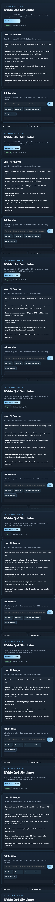

# NVMe QoS Simulator

NVMe QoS Simulator is a local storage-performance tool that models queue depth, workload mix, latency pressure, and QoS tradeoffs for NVMe/SSD systems.

## Product Screenshot



It combines deterministic simulation with a local AI analyst so users can ask why a workload is hitting tail-latency risk and what tuning action should be tested next.

## What It Does

- Loads baseline storage workload parameters.
- Simulates read/write pressure, queue depth, latency, throughput, and saturation signals.
- Produces structured QoS metrics for review.
- Displays simulation results in a browser UI.
- Adds AI explanation and chat for workload tuning.

## AI Features

- Local AI analyst explains tail-latency and saturation behavior.
- AI chat answers questions about queue depth, mixed workloads, and tuning tradeoffs.
- AI recommendations are grounded in deterministic simulation output.
- Browser UI shows metrics and AI guidance together.

## Architecture

```text
Workload parameters
      |
      v
NVMe simulator -> latency / throughput / saturation metrics
      |
      v
Local AI analyst / chat -> tuning explanation + next experiment
      |
      v
Browser dashboard
```

## Run

```powershell
run.bat
```

## Local AI Setup

Use LM Studio or another OpenAI-compatible local server with a small model such as `google/gemma-4-e4b`.

The simulator runs without AI; AI adds explanation and recommendation.

## Main Files

- `src/nvme_qos_simulator/simulator.py` - deterministic simulation logic.
- `server.py` - local API and AI chat route.
- `web/` - browser UI.
- `samples/baseline.json` - sample workload input.

## Output

The app reports simulated QoS metrics, latency pressure, saturation signals, AI analyst notes, and tuning recommendations.
